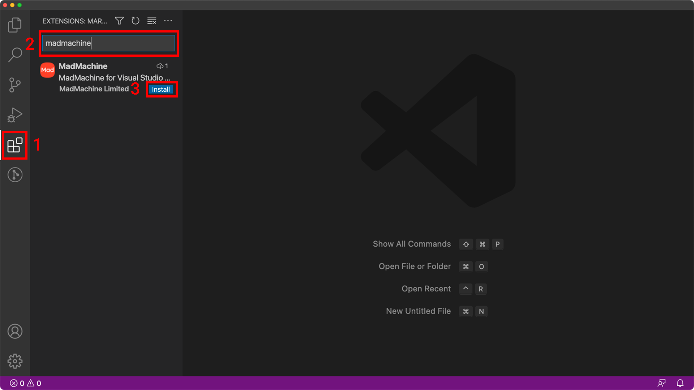
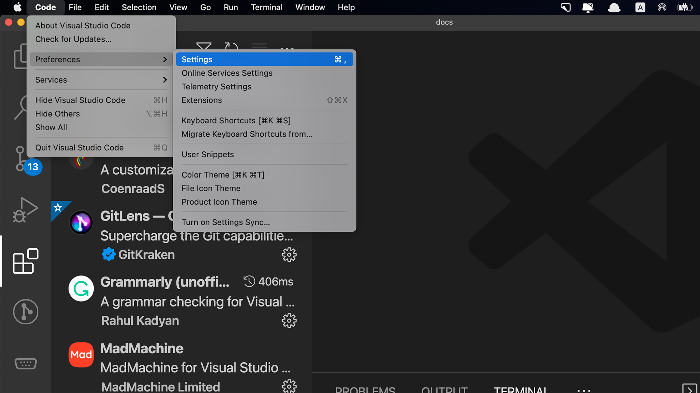
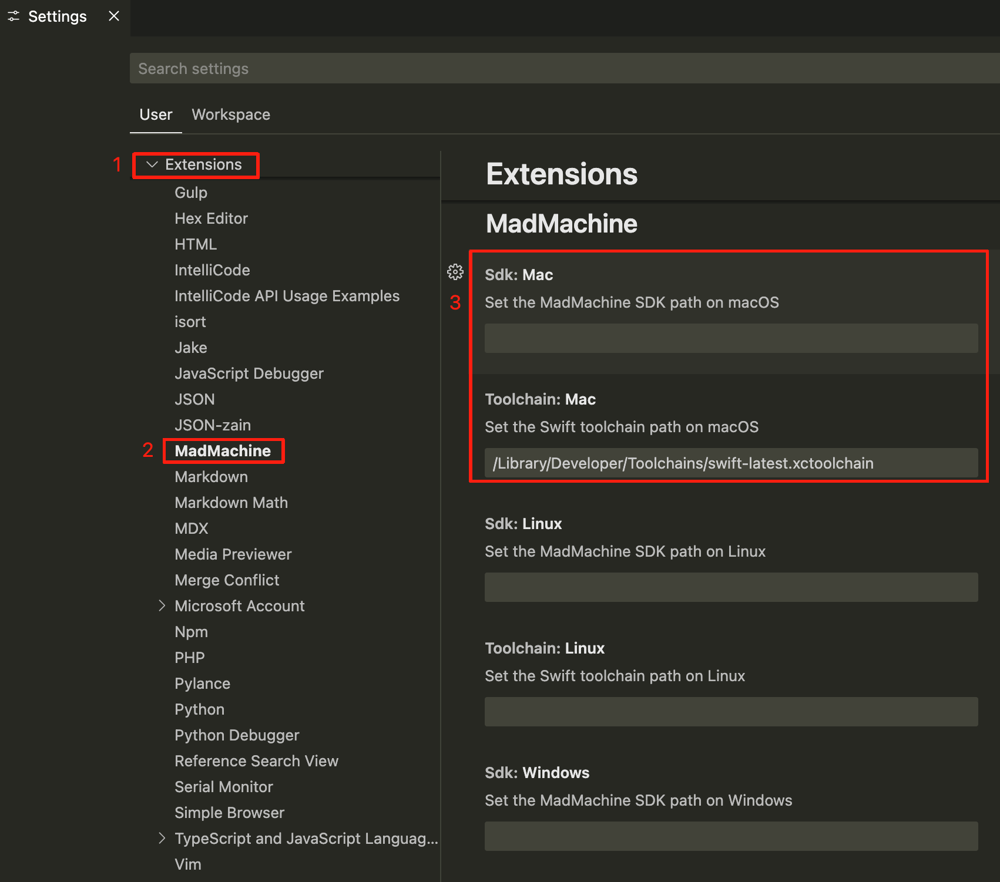
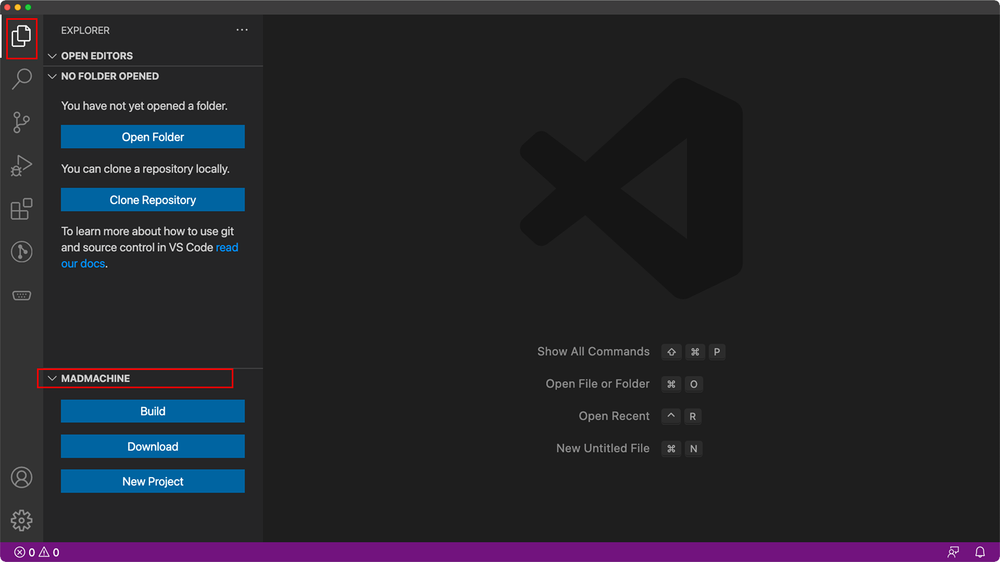

# MadMachine For Visual Studio Code

## Features

This extension simplifies the procedure of developing MadMachine projects.

## Requirements

This extension is used with [MadMachine SDK](https://github.com/madmachineio/mm-sdk/releases).

## How to use it

### Step 1: Install the extension

1. In the Visual Studio Code, click the **Extensions** icon on the left activity bar.
2. Enter **MadMachine** in the search box to find the extension in its marketplace.
3. Click the **Install** button. BTW, Serial Monitor created by Microsoft will be installed at the same time.

### Step 2: Set the extension

The extension relies on the mm sdk to do all its work. So you need to indicate its path before using the extension.

1. [**Download the latest sdk release**](https://github.com/madmachineio/mm-sdk/releases) according to your operating system and unzip it.

2. Then come back to the VS code. In the menu bar, select **Code** / **Preferences** / **Settings**.

3. In the Settings, select **Extensions** / **MadMachine**. **Enter the path of the sdk** in the box that matches your operating system. Windows is not supported since we are waiting for the good Window support of Swift language...

Now, the extension gets ready👏.

### Quick look

The extension is at the bottom of the Explore panel. All you need for your project is these three buttons:

- **Build**: build your project after you finish the code. If there are any errors, you can modify your code according to the message in the terminal. 
- **Download**: download the generated bin file to your board after building your project.
- **New Project**: create a new MadMachine project. You will decide the project type and the board type. Go [here](https://docs.madmachine.io/overview/getting-started/create-project) to learn how you can create a new project.

Welcome to our [docs](https://docs.madmachine.io/) for more info and get started with your board!

## Extension Settings

This extension contributes the following settings:

* `madmachine.sdk.mac`: The MadMachine SDK path on macOS
* `madmachine.sdk.linux`: The MadMachine SDK path on Linux

## Known Issues

## Release Notes

### 0.0.4

Initial commit
Compatible with MadMachine SDK 0.7.0 or newer

### 0.0.6

* Add a 'Copy' button to enable resource downloads to the Flash or SD card filesystem
* Compatible with MadMachine SDK 0.9.3 or newer

### 0.0.7

* Add warning information if the SDK path setting is incorrect 

### 0.0.9

* Update the warning information 

### 1.1.0

* Update for official embedded swift